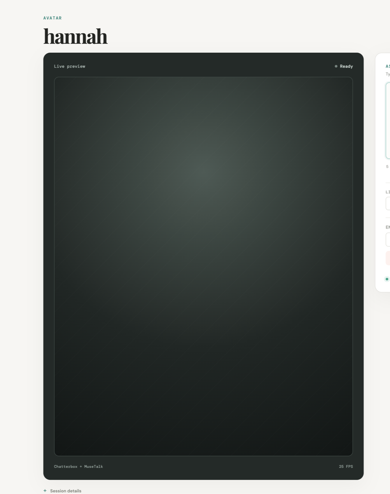

# PixelHolo

PixelHolo lets you turn one short talking-head video into a voice-driven,
lip-synced avatar. The web app is built around a simple workflow:

```text
talking video → extracted voice reference + baked face cache
             → Chatterbox TTS → MuseTalk lip sync → streamed avatar frames
```

The older StyleTTS2 training and Wav2Lip paths are still in the repository for
development and comparison. A new avatar does not need to go through training.

## Studio preview

Here is a representative view of the avatar studio. The layout will continue to
change as the UI evolves, but the output stays portrait-oriented and the active
Chatterbox + MuseTalk pipeline is shown below the preview.



## Repository layout

| Path | Responsibility | Current role |
| --- | --- | --- |
| `frontend/` | React 19 + Vite avatar studio | Profile creation, voice input, controls, and streaming playback |
| `voice_cloning/` | FastAPI worker | Preprocessing, Chatterbox, legacy StyleTTS2, profile storage, and streaming |
| `lip_syncing/` | Lip-sync model workspace | MuseTalk bridge plus the standalone/legacy Wav2Lip runner |
| `benchmarks/` | TTS comparison tools | Speed, real-time factor, GPU memory, and speaker-similarity measurements |
| `deploy/` | Production service files | Systemd units for the worker and the web/API proxy |
| `tools/` | Small operational utilities | `web_proxy.py` serves `frontend/dist` and forwards `/api` |
| `docs/assets/` | Documentation media | Representative UI screenshots used by the READMEs |
| `ios/` and `pixelholo_2_ios.xcodeproj` | Native iOS client | A separate client that uses the same inference concepts |
| `reference/` | Historical UI material | Reference material, not part of the active web build |

## What happens when a user speaks?

1. The browser creates an anonymous UUID for the current device and sends it as
   `X-PixelHolo-Workspace` with every API request.
2. `POST /upload` saves the source video in that workspace. For an avatar, the
   video's own audio is used unless a separate audio file is supplied.
3. `POST /preprocess` runs `preprocess_video.py`. Whisper/VAD cleans and splits
   the speech, while avatar baking prepares the reusable face/frame cache.
4. `POST /warmup` loads the selected profile's Chatterbox conditionals and
   MuseTalk assets before the first prompt. Caches are kept separate by profile
   and workspace.
5. `POST /speak` or `POST /chat` streams audio and, for avatars, JPEG frames.
   The frontend prefers the binary stream format and can fall back to NDJSON
   when debugging.
6. The UI lines the frames up with the audio. When the user switches profiles,
   it clears the old preview while the new profile warms up, so the previous
   face or voice cannot leak into the new session.

## Numbers at a glance

These are the defaults currently in code, not performance claims. Run
`benchmarks/tts_benchmark.py` on your GPU to collect real measurements.

| Setting | Default | Why it matters |
| --- | ---: | --- |
| Source clip shown in onboarding | 5–20 s | Enough speech for a one-shot voice reference without a long upload |
| Guided camera capture | 20 s | Gives the face and voice pipeline a consistent sample |
| Processed voice sample rate | 24,000 Hz mono | Matches Chatterbox's normal output rate |
| Speech segment length | 2–10 s | Keeps Whisper/VAD segments usable for reference and training paths |
| Minimum accepted words per segment | 4 | Drops very short/noisy speech fragments |
| Baked avatar frame rate | 25 FPS | Stable browser playback and MuseTalk timing |
| Default avatar loop | 20 s | Reuses a bounded source loop instead of re-detecting faces live |
| Loop cross-fade | 0.15 s | Hides the loop seam when the source clip is repeated |
| Stream chunk staircase | 4 → 10 → 25 words | Sends a small first chunk, then larger chunks for throughput |
| MuseTalk stream window | 1.2 s | Limits the amount of video work kept ahead of playback |
| MuseTalk look-ahead | 0.16 s | Adds a small scheduling buffer for frame/audio alignment |
| First MuseTalk text chunk | 72 characters | Starts the avatar quickly before cruise-sized chunks |
| MuseTalk JPEG quality | 92 | Keeps streamed frames sharp without maximum-size JPEGs |
| Browser avatar frame edge cap | 1,080 px | Prevents a high-resolution source from overwhelming the browser |
| Warmup cache age | 120 s | Reuses a recently prepared profile while avoiding stale resources |

## Quickstart (local development)

### Prerequisites

For practical Chatterbox/MuseTalk inference, use a Linux host with an NVIDIA
GPU. You will also need `ffmpeg`, `espeak-ng`, Node.js 18 or newer, and a
Python version supported by the pinned packages. There are two ways to set up
the Python environment:

- `setup_env.sh` creates a conda environment at `.venv` with Python 3.10 and
  installs the shared CUDA-oriented stack.
- The commands below create separate `voice_cloning/.venv` and
  `lip_syncing/.venv` environments, which is useful when you want to keep the
  two dependency sets isolated.

Before trying a real stream, download the model repositories and weights
described in [`voice_cloning/README.md`](voice_cloning/README.md) and
[`lip_syncing/README.md`](lip_syncing/README.md).

### Option A: shared conda bootstrap

```bash
bash setup_env.sh
conda activate "$PWD/.venv"
```

The script installs a nightly PyTorch CUDA 13.0 wheel. Read it first if the
machine uses a different driver or CUDA toolkit.

### Option B: separate virtual environments

```bash
cd voice_cloning
python3 -m venv .venv
source .venv/bin/activate
python -m pip install -r requirements.txt
deactivate

cd ../lip_syncing
python3 -m venv .venv
source .venv/bin/activate
python -m pip install -r requirements.txt
deactivate

cd ../frontend
npm install
```

Start the services in separate terminals:

```bash
# Terminal 1: FastAPI inference worker
cd voice_cloning
source .venv/bin/activate
uvicorn src.inference:app --host 0.0.0.0 --port 8000

# Terminal 2: Vite development server
cd frontend
npm run dev
```

Open [http://127.0.0.1:5174](http://127.0.0.1:5174). The port is explicit in
`frontend/vite.config.ts`.

For an optional LLM assistant, create a root `.env` file:

```dotenv
GROQ_API_KEY=your_key_here
OPENAI_API_KEY=your_key_here
GEMINI_API_KEY=your_key_here

# Optional live-search tuning
OPENAI_LIVE_SEARCH_MODEL=gpt-4o-mini
OPENAI_REALTIME_MAX_OUTPUT_TOKENS=512
OPENAI_REASONING_EFFORT=none
```

## Create an avatar from the command line

The web app runs this same pipeline. You can also run it directly:

```bash
cd voice_cloning
source .venv/bin/activate
python src/preprocess_video.py \
  --video /absolute/path/to/talking_video.mp4 \
  --name alvin \
  --avatar_fps 25 \
  --avatar_loop_sec 20 \
  --avatar_loop_fade_sec 0.15
```

This creates an avatar profile with a layout like:

```text
voice_cloning/data/avatar_profiles/alvin/
├── raw_videos/       # uploaded source clip
├── raw_audio/        # optional separate audio override
├── processed_wavs/   # cleaned 24 kHz voice segments
├── metadata.csv      # segment metadata
└── avatar_cache/     # frames.npy, coords.npy, and runtime metadata
```

Start the worker, then warm the profile before the first request:

```bash
curl -X POST http://127.0.0.1:8000/warmup \
  -H 'Content-Type: application/json' \
  -d '{"profile":"alvin","profile_type":"avatar","tts_backend":"chatterbox","lipsync_backend":"musetalk"}'
```

## API examples

The FastAPI worker can be used without the frontend. The examples below show
the workspace header explicitly; keep one UUID per browser/device workspace.

```bash
export PIXELHOLO_WORKSPACE='11111111-2222-4333-8444-555555555555'
export API='http://127.0.0.1:8000'
export PROFILE='alvin'
```

List profiles:

```bash
curl "$API/profiles?profile_type=avatar" \
  -H "X-PixelHolo-Workspace: $PIXELHOLO_WORKSPACE"
```

Upload a talking video:

```bash
curl -X POST "$API/upload" \
  -H "X-PixelHolo-Workspace: $PIXELHOLO_WORKSPACE" \
  -F "profile=$PROFILE" \
  -F 'profile_type=avatar' \
  -F 'file=@/absolute/path/to/talking_video.mp4;type=video/mp4'
```

Preprocess the newest upload and bake a 25 FPS, 20-second avatar loop:

```bash
curl -N -X POST "$API/preprocess" \
  -H "X-PixelHolo-Workspace: $PIXELHOLO_WORKSPACE" \
  -H 'Content-Type: application/json' \
  -d '{
    "profile":"alvin",
    "profile_type":"avatar",
    "bake_avatar":true,
    "avatar_fps":25,
    "avatar_loop_sec":20,
    "avatar_loop_fade_sec":0.15,
    "avatar_pads":"0 10 0 0"
  }'
```

Generate a streamed avatar response:

```bash
curl -N -X POST "$API/speak" \
  -H "X-PixelHolo-Workspace: $PIXELHOLO_WORKSPACE" \
  -H 'Content-Type: application/json' \
  -H 'Accept: application/vnd.pixelholo.stream-v1' \
  -H 'X-PixelHolo-Transport: binary' \
  -d '{
    "text":"Welcome to PixelHolo. Your avatar is ready.",
    "speaker":"alvin",
    "avatar_profile":"alvin",
    "profile_type":"avatar",
    "tts_backend":"chatterbox",
    "lipsync_backend":"musetalk",
    "avatar_emotion":"neutral",
    "avatar_fps":25,
    "avatar_max_frame_edge":1080
  }' > avatar.stream
```

To use the easier-to-read format, omit the two binary headers. The response
will then be `application/x-ndjson`: each line contains an audio chunk (base64
WAV plus metadata) or an event such as `done` or `error`. Binary packets use
the `application/vnd.pixelholo.stream-v1` media type and `PHS1` framing. The
frontend parser is the best reference for clients that need to consume it.

Useful routes:

| Method and path | Purpose |
| --- | --- |
| `GET /lipsync_backend` | Report resolved TTS/lip-sync backends and runtime id |
| `GET /profiles` | List voice or avatar profiles |
| `POST /upload` | Store a video source |
| `POST /upload_audio` | Store an optional audio override |
| `POST /preprocess` | Extract audio, segment speech, and optionally bake the avatar |
| `POST /warmup` | Prepare profile-specific TTS and lip-sync assets |
| `POST /speak` | Stream one fixed text prompt |
| `POST /chat` | Ask the optional LLM, then stream the response |
| `POST /stream` | Audio-only NDJSON stream |
| `POST /stream_avatar` | Avatar stream for one fixed text prompt |
| `POST /generate` | Non-streaming WAV or base64 WAV |
| `POST /interrupt` | Stop active streams in the current workspace |
| `PATCH /profiles/{name}` | Rename a profile and rewrite its references |
| `DELETE /profiles/{name}` | Delete profile data and warmup markers |

## Anonymous device workspaces

PixelHolo does not have accounts yet. Instead, the frontend stores a UUID in
`localStorage` under `pixelholo_workspace_id` and sends it in
`X-PixelHolo-Workspace`. The backend validates the UUID and maps it to separate
storage roots:

```text
data/workspaces/<workspace-uuid>/avatar_profiles/<profile>/...
outputs/workspaces/<workspace-uuid>/...
```

Requests without the header use the `legacy` developer workspace, which keeps
existing CLI profiles working. This separates data, but it is not
authentication: anyone who can reach the worker and knows a workspace UUID can
address that workspace. When accounts are added, the header can be replaced by
a server-issued account or tenant identifier. Clearing site data or using a
different browser starts a new empty workspace.

## Configuration and tuning

### Frontend environment variables

| Variable | Default | Effect |
| --- | --- | --- |
| `VITE_PIXELHOLO_API_BASE` | development: `http://127.0.0.1:8000`; production: `/api` | FastAPI origin override |
| `VITE_PIXELHOLO_BINARY_STREAM` | enabled in the current client | Prefer binary avatar packets; disable to debug NDJSON |
| `VITE_PIXELHOLO_BINARY_PCM_AUDIO` | enabled in the current client | Use raw PCM audio packets when supported |
| `VITE_PIXELHOLO_AVATAR_MAX_FRAME_EDGE` | `1080` | Client-side maximum frame edge in pixels |
| `VITE_PIXELHOLO_AUDIO_START_DELAY_SEC` | `0.04` | Audio-only playback start delay |
| `VITE_PIXELHOLO_AVATAR_AUDIO_START_DELAY_SEC` | `0.34` | Avatar playback delay while the first frames arrive |
| `VITE_PIXELHOLO_AVATAR_AUDIO_CHUNK_LEAD_SEC` | `0.08` | Lead time for subsequent avatar audio chunks |
| `VITE_PIXELHOLO_VIDEO_PREDECODE_PREWAIT_MS` | `45` | Small frame predecode wait |

### Backend environment variables

| Variable | Default | Effect |
| --- | ---: | --- |
| `PIXELHOLO_TTS_BACKEND` | `chatterbox` | Default TTS adapter (`chatterbox` or legacy `styletts2`) |
| `CHATTERBOX_DEVICE` | CUDA when available, otherwise CPU | Chatterbox device selection |
| `LIPSYNC_BACKEND` | `musetalk` | Runtime lip-sync backend (`musetalk` or `wav2lip`) |
| `LIPSYNC_BACKEND_FALLBACK` | off | Allow MuseTalk initialization failure to fall back to Wav2Lip |
| `MUSE_TALK_FACE_SCALE` | `1.0` | Face crop scale, clamped by the backend to `0.75–1.15` |
| `MUSE_TALK_MAX_CHUNK_CHARS` | `120` | Maximum text size for one MuseTalk window |
| `MUSE_TALK_FIRST_CHUNK_CHARS` | `72` | First window size for faster startup |
| `MUSE_TALK_STREAM_WINDOW_SEC` | `1.2` | Stream scheduling window |
| `MUSE_TALK_LOOKAHEAD_SEC` | `0.16` | Frame look-ahead buffer |
| `MUSE_TALK_JPEG_QUALITY` | `92` | JPEG quality for streamed frames |
| `MUSE_TALK_MODELS_DIR` | `lip_syncing/lib/MuseTalk/models` | MuseTalk model directory |
| `PIXELHOLO_IDLE_CLEANUP_INTERVAL_SEC` | `30` | Background idle-cache cleanup interval |

Many TTS and avatar values can be overridden in the request body. Start with
the defaults and tune them only after measuring a representative prompt set.

## Benchmarking voice quality and speed

`benchmarks/tts_benchmark.py` is the repeatable comparison tool for Chatterbox
variants and StyleTTS2. It writes audio samples for listening as well as
machine-readable metrics. Run it on a GPU host like this:

```bash
python benchmarks/tts_benchmark.py \
  --project-root /home/alvin/PixelHolo_trial \
  --reference voice_cloning/data/avatar_profiles/alvin2_video/processed_wavs/alvin2_video_0065.wav \
  --backends chatterbox styletts2 \
  --output-dir outputs/benchmarks/tts_suite
```

The default suite contains **4 prompts × 3 seeds = 12 generations per
backend**. It records:

- cold model load time (`load_sec`);
- reference conditioning time (`prepare_sec`);
- generation time and generated duration (`generation_sec`, `audio_sec`);
- real-time factor (`rtf`, where `< 1.0` is faster than playback);
- peak allocated GPU memory (`peak_gpu_mem_mb`);
- speaker-embedding cosine similarity to the reference;
- mean and maximum cross-seed drift for each prompt.

Optional adapters cover `chatterbox_mtl`, `chatterbox_turbo`, `chatterbox_vc`,
and StyleTTS2. If an optional package is missing, the run records it as
skipped instead of treating it as a passing result. This repository does not
include benchmark results; run the command on the target GPU first.

## Production deployment

The checked-in deployment files match the current Linux development VM. They
keep the backend private and put a small proxy in front of it:

```text
browser → pixelholo.com:8080 (tools/web_proxy.py)
                         ├── static frontend/dist
                         └── /api/* → 127.0.0.1:8000 (FastAPI)
```

- `deploy/systemd/pixelholo-backend.service` starts Uvicorn on
  `127.0.0.1:8000` and restarts it if it exits.
- `deploy/systemd/pixelholo-web.service` serves the built frontend on
  `100.120.224.119:8080` and forwards `/api` to the backend.
- `tools/web_proxy.py` streams responses instead of buffering avatar frames and
  accepts request bodies up to 1 GiB for video uploads.

Build the frontend before enabling the web service:

```bash
cd frontend
npm run build
```

Install and enable the unit files on the deployment host, then point DNS or the
tunnel at the proxy. These files are templates, so update the `User`,
`WorkingDirectory`, virtualenv, static root, and bind address for the target
machine before enabling them.

## Legacy and optional paths

- **StyleTTS2:** trained voice profiles, checkpoints, pronunciation lexicons,
  and older inference controls live under `voice_cloning/lib/StyleTTS2` and
  `voice_cloning/outputs/training`. They are useful for stable-speaker
  comparisons, but new avatar setup skips training.
- **Wav2Lip:** the `lip_syncing/` runner can create a complete output video and
  can be selected as a fallback. MuseTalk is the current runtime default.
- **Whisper/VAD:** preprocessing uses transcription and voice-activity checks
  to clean the voice reference. It is not the conversational LLM.

## Troubleshooting

| Symptom | Checks |
| --- | --- |
| `ModuleNotFoundError` | Activate the matching `voice_cloning/.venv` or `lip_syncing/.venv`; make sure you are using the right interpreter. |
| Audio works but no avatar frames | Check the MuseTalk repo and weights, `LIPSYNC_BACKEND`, and the profile's `avatar_cache/frames.npy` and `coords.npy`. |
| First prompt is slow | Call `POST /warmup` for the selected profile and backend; the first model load is expected to be slower. |
| Wrong profile face/voice after switching | Send the selected profile and workspace header with every request. The UI clears the preview during warmup on purpose. |
| Stream stalls or runs out of memory | Check GPU memory, lower MuseTalk batch/window settings, and cap browser frames at `1080` px. |
| `ERR_NAME_NOT_RESOLVED` in a browser | DNS or the tunnel is not routing the hostname yet. Test the VM proxy directly before debugging the app. |
| Profile list looks empty | A new browser/device has a new anonymous workspace; requests without a header see the legacy developer workspace. |

For a quick health check, start the API and run:

```bash
curl http://127.0.0.1:8000/lipsync_backend
curl 'http://127.0.0.1:8000/profiles?profile_type=avatar'
```
