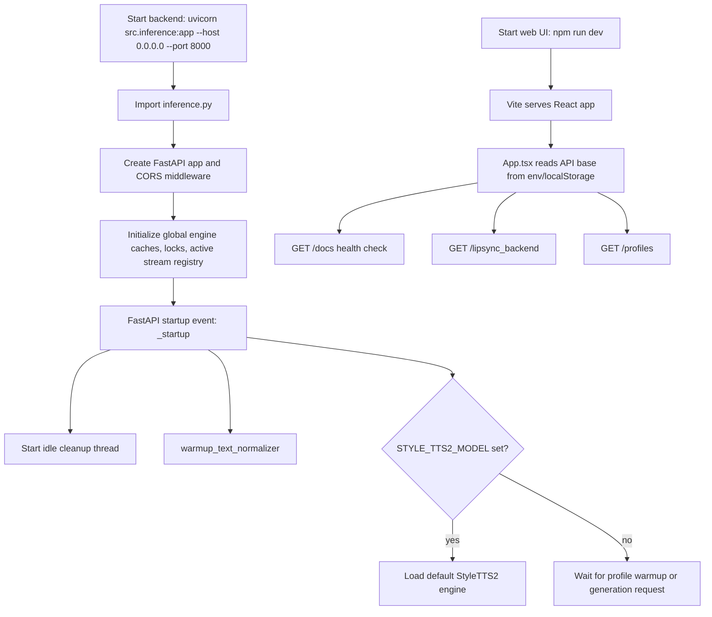
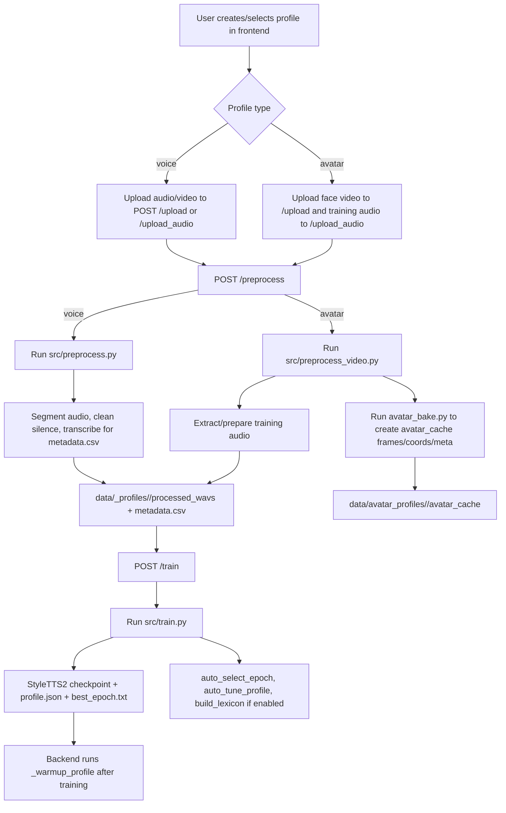
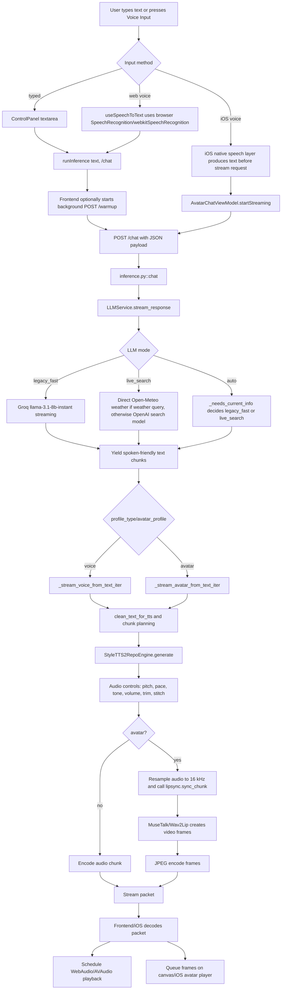
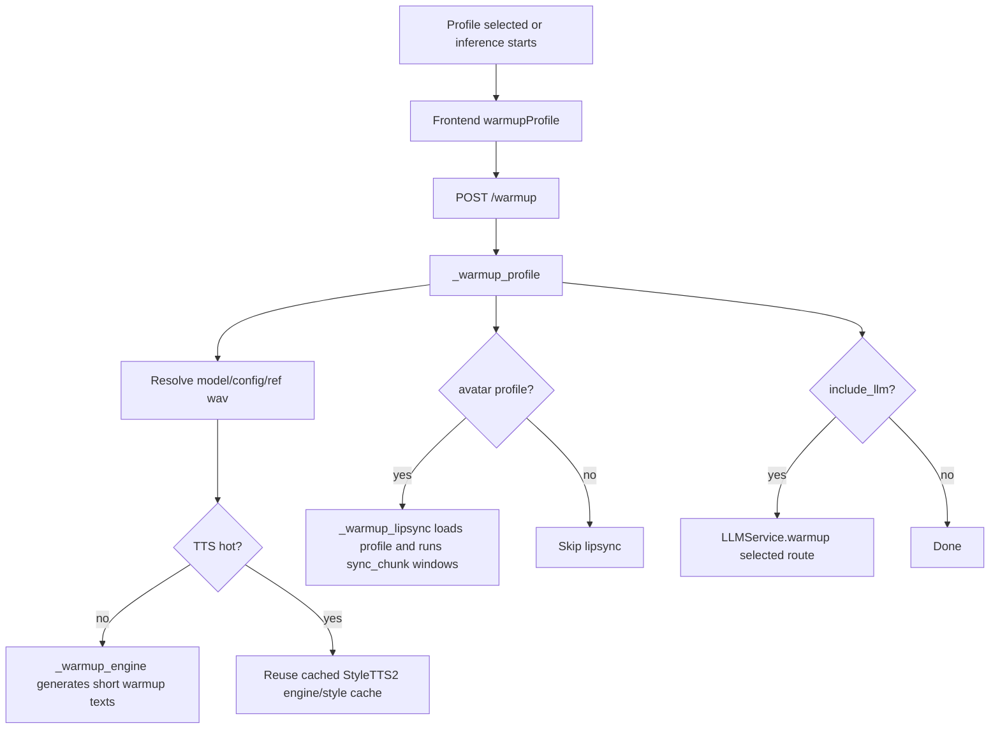

# PixelHolo Runtime Flow and Latency Notes

This document describes the current runtime shape of the project as of May 19, 2026. It is based on the current code paths in `frontend/`, `ios/`, `voice_cloning/`, and `lip_syncing/`.

## 1. System Components

| Layer | Main files | Responsibility |
| --- | --- | --- |
| Web UI | `frontend/App.tsx`, `frontend/components/ControlPanel.tsx`, `frontend/hooks/useSpeechToText.ts` | Profile management, browser voice input, chat/direct TTS controls, binary stream decode, WebAudio playback, canvas avatar playback. |
| iOS UI | `ios/PixelHoloClient/ViewModels/AvatarChatViewModel.swift`, `ios/PixelHoloClient/Networking/StreamingClient.swift`, `ios/PixelHoloClient/Media/AvatarPlayer.swift` | Native thin client that sends streaming requests and plays returned audio/video chunks. |
| Backend API | `voice_cloning/src/inference.py` | FastAPI app, profile upload/preprocess/train routes, warmup, LLM/TTS/avatar streaming orchestration. |
| LLM router | `voice_cloning/src/llm/llm_service.py` | Chooses legacy fast, live search, or auto route; streams LLM text chunks; handles direct weather and API fallback/errors. |
| TTS | `voice_cloning/src/inference.py::StyleTTS2RepoEngine` plus `voice_cloning/lib/StyleTTS2` | Loads StyleTTS2 profile checkpoint, phonemizes text, generates cloned voice audio. |
| Text normalization | `voice_cloning/src/text_normalize.py`, `voice_cloning/src/pronunciation_dict.py` | Converts text into spoken-friendly form before TTS, including abbreviation and pronunciation fixes. |
| Lip sync | `voice_cloning/src/musetalk_bridge.py`, `voice_cloning/src/lipsync_bridge.py` | MuseTalk or Wav2Lip runtime bridge. MuseTalk is the current UI default. |
| Profile data | `voice_cloning/config.py` | Defines `data/voice_profiles`, `data/avatar_profiles`, `outputs/training`, avatar cache, raw uploads, processed WAVs. |
| Training/preprocess | `voice_cloning/src/preprocess.py`, `voice_cloning/src/preprocess_video.py`, `voice_cloning/src/avatar_bake.py`, `voice_cloning/src/train.py` | Upload processing, Whisper transcription for datasets, avatar cache baking, StyleTTS2 fine-tuning, lexicon/profile output. |

## 2. Startup Flow

Important startup behavior:

- `voice_cloning/src/inference.py::_startup` starts the cleanup thread and warms text normalization.
- TTS engines and lip-sync engines are lazy-loaded unless `STYLE_TTS2_MODEL` is set.
- Idle engine eviction is handled by `_runtime_cleanup_loop`, `_evict_idle_tts_engines`, and `_evict_idle_lipsync_engines`.
- Frontend default API base is `http://127.0.0.1:8000` in `frontend/App.tsx::DEFAULT_API_BASE`.
- Frontend default output is voice-only, default LLM mode is `legacy_fast`, and default avatar backend state is `musetalk`.

## 3. Profile Creation Flow

Key outputs:

- Voice/avatar dataset root comes from `voice_cloning/config.py::dataset_root`.
- Raw uploads go to `raw_videos/` and `raw_audio/`.
- Training output goes to `voice_cloning/outputs/training/<profile_type>/<profile>/`.
- Runtime profile defaults are read from `profile.json`, selected checkpoint from `best_epoch.txt`, and pronunciation overrides from `lexicon.json`.
- Avatar runtime cache uses `avatar_cache/frames.npy`, `coords.npy`, optional `musetalk_coords.npy`, `musetalk_latents*.pt`, and `musetalk_masks*.pkl`.

## 4. Main Chat and Avatar Flow

Important runtime details:

- Web voice input does not send raw microphone audio to the backend. `frontend/hooks/useSpeechToText.ts::useSpeechToText` uses the browser speech API and sends final text.
- `frontend/components/ControlPanel.tsx` has two modes: `Chat (LLM)` calls `/chat`; `Say (TTS)` calls `/speak`.
- `/chat` uses LLM first; `/speak` skips LLM and speaks the provided text directly.
- `frontend/App.tsx::runInference` sends selected profile, profile type, voice controls, LLM mode, avatar profile, lipsync backend, and MuseTalk preset.
- The current binary stream format is `application/vnd.pixelholo.stream-v1`, magic `PHS1`, then JSON metadata length, payload length, metadata, and payload.
- Binary payload layout is audio bytes first, then concatenated JPEG frame bytes. Metadata includes `audio_bytes_len` and `frame_lengths`.
- NDJSON remains the fallback if binary transport is disabled or not returned.

## 5. LLM Routing Specification

| Mode | Code | Model/provider | Behavior |
| --- | --- | --- | --- |
| Legacy Fast | `LLM_MODE_LEGACY_FAST` in `llm_service.py` | Groq `llama-3.1-8b-instant` | Fast general answers. No true live web/search access. |
| Live Search | `LLM_MODE_LIVE_SEARCH` | OpenAI `gpt-4o-mini-search-preview` by default | Current facts, weather, news, prices, post-2023 info. Weather can bypass LLM via Open-Meteo direct response. |
| Auto | `LLM_MODE_AUTO` | Chooses one of the above | `_needs_current_info` checks strong and weak live-signal regexes. Strong signals always use live search; weak signals can be suppressed by legacy-prefer patterns. After a live answer, short follow-up-style prompts can stay on live search for a limited number of turns. |

LLM processing path:

1. `inference.py::chat` calls `_get_llm_service()`.
2. `LLMService.stream_response` appends the user message to in-memory conversation history.
3. `resolve_route` normalizes mode aliases and applies auto routing.
4. If live search and weather query, `_direct_weather_answer` calls Open-Meteo geocoding and forecast APIs.
5. Otherwise `_stream_from_route` streams tokens from OpenAI or Groq.
6. `_stream_from_route` buffers tokens into sentence-like spoken chunks and avoids splitting protected abbreviations.
7. Those chunks feed TTS as soon as they are yielded.

Auto follow-up behavior:

- A live answer marks short-lived live context in memory.
- For the next `LLM_AUTO_LIVE_FOLLOWUP_TURNS` turns, default `2`, auto mode can keep using live search if the prompt looks like a follow-up, such as "what about that?" or "should I bring an umbrella then?"
- The follow-up window expires after `LLM_AUTO_LIVE_FOLLOWUP_TTL_SEC`, default `600`.
- New creative, coding, writing, translation, math, or explanation tasks still prefer the fast model and use the shared conversation history instead of forcing live search again.
- This memory is process-local. Restarting the backend creates a new `LLMService` and clears conversation history plus live-follow-up state.

Current history limits:

- Legacy route: up to `MAX_HISTORY_MESSAGES = 8`, with `GROQ_MAX_MESSAGE_CHARS` and `GROQ_MAX_HISTORY_CHARS`.
- Live route: defaults to shorter history via `GROQ_REALTIME_HISTORY_MESSAGES`, `GROQ_REALTIME_MAX_MESSAGE_CHARS`, and `GROQ_REALTIME_MAX_HISTORY_CHARS` to avoid request-too-large errors.

## 6. TTS and Audio Specification

Primary code path:

- `inference.py::_stream_voice_from_text_iter`
- `inference.py::_stream_avatar_from_text_iter`
- `inference.py::StyleTTS2RepoEngine`

Steps:

1. Resolve `model_path`, `config_path`, `ref_wav_path`, profile defaults, phonemizer language, and lexicon.
2. Clean the text with `clean_text_for_tts`.
3. Split text using `_plan_stream_tts_chunks`.
4. Generate audio with `StyleTTS2RepoEngine.generate`.
5. Trim leading silence for first stream chunks, apply voice controls, and soft-clip.
6. Add punctuation pauses: sentence pauses use `pause_ms`; comma/semicolon/colon pauses use a shorter comma pause.
7. Smooth chunk boundaries with `AudioStitcher`.
8. Encode audio as WAV or `pcm_s16le` depending on client headers.

Hot-path TTS settings in `/chat`:

- `alpha = 0.2`
- `beta = 0.5`
- `embedding_scale = 1.2`
- `diffusion_steps = STYLE_TTS2_CHAT_DIFFUSION_STEPS`, default `10`
- `seed = 1234`
- `pad_text = true`
- smart trim disabled by default for chat stream (`smart_trim_db = 0`)

## 7. Avatar and MuseTalk Specification

Primary code path:

- `inference.py::_stream_avatar_from_text_iter`
- `musetalk_bridge.py::MuseTalkBridge.load_profile`
- `musetalk_bridge.py::MuseTalkBridge.sync_chunk`

Current product default preset:

- `DEFAULT_MUSETALK_PRESET = "realistic"`
- `stream_window_sec = 1.65`
- `first_window_sec = 0.55`
- `startup_window_sec = 0.55`
- `startup_window_chunks = 2`
- `lookahead_sec = 0.28`
- `temporal_smooth = 0.20`
- `audio_history_sec = 3.25`
- `jpeg_quality = 95`
- `first_chunk_chars = 96`
- `max_chunk_chars = 140`

MuseTalk runtime steps:

1. `load_profile` loads baked avatar frames and coordinates from `avatar_cache`.
2. It chooses coordinate source: `legacy`, `baked`, or `auto`.
3. If requested, it builds a lower-resolution runtime frame cache controlled by `avatar_max_frame_edge`.
4. It loads or builds VAE latents and masks for each avatar frame.
5. During streaming, audio is resampled to 16 kHz.
6. `sync_chunk` keeps rolling audio history plus optional lookahead.
7. Whisper encoder features are extracted from the audio context.
8. MuseTalk UNet predicts mouth/face latents.
9. VAE decodes generated face patches.
10. `_blend_frame` composites generated face into the original loop frame using masks, temporal smoothing, color match, and sharpening.
11. Backend JPEG-encodes frames and streams them with the audio chunk.

## 8. Warmup and Cache Behavior

Important warmup/cache points:

- Frontend caches warmup success for 120 seconds using `WARMUP_CACHE_MAX_AGE_MS`.
- Backend idle TTS and lip-sync engines are evicted after `STYLE_TTS2_IDLE_EVICT_SEC` and `LIPSYNC_IDLE_EVICT_SEC`, default 180 seconds.
- Cleanup thread wakes every `PIXELHOLO_IDLE_CLEANUP_INTERVAL_SEC`, default 30 seconds.
- TTS engine load now forces real CPU tensor construction before moving to the runtime device to avoid PyTorch `meta` tensor warmup failures.
- MuseTalk warmup runs first/startup/full windows so the first real avatar chunks should avoid one-time model/cache stalls.

## 9. Output Playback

Web:

- `frontend/App.tsx::decodeBinaryStream` parses `PHS1` packets.
- `decodeAudioChunk` decodes WAV or PCM into `AudioBuffer`.
- `scheduleBuffer` schedules audio in WebAudio using a lead time.
- Voice mode uses low lead time; avatar mode uses larger lead time so frames can queue.
- `enqueueFrames` maps returned frame count over `duration_sec` and draws frames in `requestAnimationFrame`.
- First chunk latency is measured as time from `runInference` start to first valid audio chunk.

iOS:

- `StreamingClient.stream` posts JSON with binary stream headers.
- `BinaryPacketParser` parses the same `PHS1` packet format.
- `decodeChunk` decodes audio with `WAVDecoder` and separates JPEG frame payloads.
- `AvatarChatViewModel.startStreaming` calls warmup, starts the stream, and pushes chunks into `AvatarPlayer`.

## 10. Latency Budget Table

These ranges are analysis targets, not fixed guarantees. Actual values depend on GPU, profile cache state, network, selected model, browser/iOS device, and prompt length.

| Stage | Where | Hot-path latency pressure | Notes and current knobs |
| --- | --- | --- | --- |
| User speech finalization | Browser/iOS speech APIs | 200 ms to 1500+ ms after user stops talking | Web uses browser `SpeechRecognition`; backend does not receive raw mic audio. This can dominate perceived latency before backend starts. |
| Frontend request setup | `App.tsx::runInference`, `AvatarChatViewModel.startStreaming` | 5 ms to 80 ms local/LAN | Includes interrupting old stream, audio unlock, JSON encode, and request start. |
| Warmup | `POST /warmup`, `_warmup_profile` | 0 ms hot, 3 s to 30+ s cold | Should be background or pre-switch. Cold TTS/lipsync/model loads should not be waited on in the web path unless iOS explicitly ensures warmup. |
| LLM route decision | `LLMService.resolve_route`, `_needs_current_info` | Usually under 5 ms | Regex routing is cheap. Auto mode itself is not a major latency source. |
| Legacy LLM first text | Groq `llama-3.1-8b-instant` | Often hundreds of ms to low seconds | Fastest general mode. Network/provider queueing is the main variable. |
| Live search/current info | OpenAI search model or Open-Meteo direct weather | Weather direct often sub-second; web search can be 1 s to 4+ s | Direct weather avoids full LLM search. Search latency is network/tool dependent. |
| LLM chunk buffering | `LLMService._stream_from_route` | Adds roughly until first punctuation or min chunk threshold | First chunk threshold is lower than later chunks to start TTS sooner. Protected abbreviation logic avoids bad splits. |
| Text normalization | `clean_text_for_tts`, pronunciation dictionary | Usually small after warmup | Startup warms normalizer. Pronunciation fixes reduce TTS mistakes but add little runtime cost. |
| First TTS chunk | `StyleTTS2RepoEngine.generate` | Hundreds of ms to multiple seconds depending token count and GPU | Controlled mainly by chunk length and `STYLE_TTS2_CHAT_DIFFUSION_STEPS`. Style cache and warmup matter. |
| Audio post-processing | trim, pitch/pace/tone/volume, stitcher | Usually tens of ms; pace shift can cost more | `pace_scale` uses time stretch when not 1.0. Avoid excessive audio effects on hot path. |
| MuseTalk windowing wait | `_stream_avatar_from_text_iter` | Intentional wait for 0.55 s first audio window, then startup windows | Current realistic preset: first two/three avatar packets use 0.55 s windows before full 1.65 s windows. |
| MuseTalk inference | `MuseTalkBridge.sync_chunk` | Hundreds of ms to seconds per window | Depends on window size, `infer_fps`, batch size, GPU, runtime cache, and lookahead. |
| JPEG encode | `_encode_jpeg_frames` | Tens to hundreds of ms | Parallel JPEG executor uses `PIXELHOLO_JPEG_ENCODE_WORKERS`. Quality and frame edge affect cost. |
| Network transfer | Backend stream to client | LAN usually low; remote VM can add visible delay | Binary transport avoids base64 overhead. JPEG frames are the largest payload. |
| Client audio decode | WebAudio/iOS WAV decode | Tens of ms | PCM mode can avoid WAV decode on web if enabled with `VITE_PIXELHOLO_BINARY_PCM_AUDIO=1`. |
| Playback lead/buffer | `scheduleBuffer`, avatar frame queue | Voice: about 80 ms start delay; avatar: about 340 ms start delay plus 80 ms chunk lead | These are intentional anti-stutter buffers: `VITE_PIXELHOLO_AUDIO_START_DELAY_SEC`, `VITE_PIXELHOLO_AVATAR_AUDIO_START_DELAY_SEC`, `VITE_PIXELHOLO_AVATAR_AUDIO_CHUNK_LEAD_SEC`. |
| Canvas/image decode | `createImageBitmap`, `enqueueFrames`, RAF draw loop | Tens to hundreds of ms depending frame count/device | Frame predecode wait is controlled by `VITE_PIXELHOLO_VIDEO_PREDECODE_PREWAIT_MS`. |

## 11. Where Latency Is Most Likely Spent

For a hot avatar chat request, the biggest likely costs are:

1. Speech recognition finalization before the backend request starts.
2. LLM first useful spoken chunk, especially live search.
3. First StyleTTS2 chunk.
4. Waiting until enough audio exists for MuseTalk's first window.
5. MuseTalk inference plus JPEG encode and client frame decode.
6. Intentional client playback lead to avoid pauses/glitches.

For voice-only chat, the biggest likely costs are:

1. Speech recognition finalization.
2. LLM first chunk.
3. First StyleTTS2 chunk.
4. Client audio decode/playback lead.

For direct `/speak`, the LLM cost is removed. The flow starts at text normalization and TTS.

## 12. Practical Latency Levers

Lowest-risk levers:

- Keep profile warmup hot by calling `/warmup` on profile switch and before the first real request.
- Keep `legacy_fast` for non-current questions; use `auto` only when current info is needed.
- Use Open-Meteo direct weather for weather questions instead of a full live-search answer.
- Keep first LLM/TTS chunks short enough to start playback quickly.
- Keep binary transport enabled.
- Keep avatar max frame edge reasonable for web/mobile so JPEG and MuseTalk costs stay bounded.

Higher-risk levers:

- Lower MuseTalk first/window sizes further. This reduces time to first frame but can worsen motion stability.
- Lower JPEG quality or output FPS. This reduces transfer/decode cost but can reduce visual quality.
- Use PCM audio in binary transport. This avoids browser WAV decode but needs careful client compatibility.
- Replace JPEG frame packets with H.264/WebCodecs/WebRTC. This is likely a major latency/bandwidth win, but it is a larger architecture change.
- Incrementally cache Whisper features in MuseTalk. This could reduce repeated work, but needs careful sync testing.

## 13. Debugging and Metrics

Useful logs and metrics:

- Frontend shows `Time to First Audio` and chunk count in `App.tsx`.
- Backend logs `component=llm op=chat_request ... request_chars=...`.
- Backend logs `component=stream op=avatar_stream_config ...` with MuseTalk window/fps/preset settings.
- StyleTTS2 prints `[TTS timing]` with phonemize/style/text/bert/diffusion/decoder timing.
- `/warmup` response reports `tts_hot_before`, `tts_ready`, `lipsync_hot_before`, `lipsync_ready`, and `elapsed_ms`.
- `voice_cloning/src/benchmark_stream_latency.py` can be used to compare TTFA, chunk timing, and underflow risk for specific profiles and settings.
